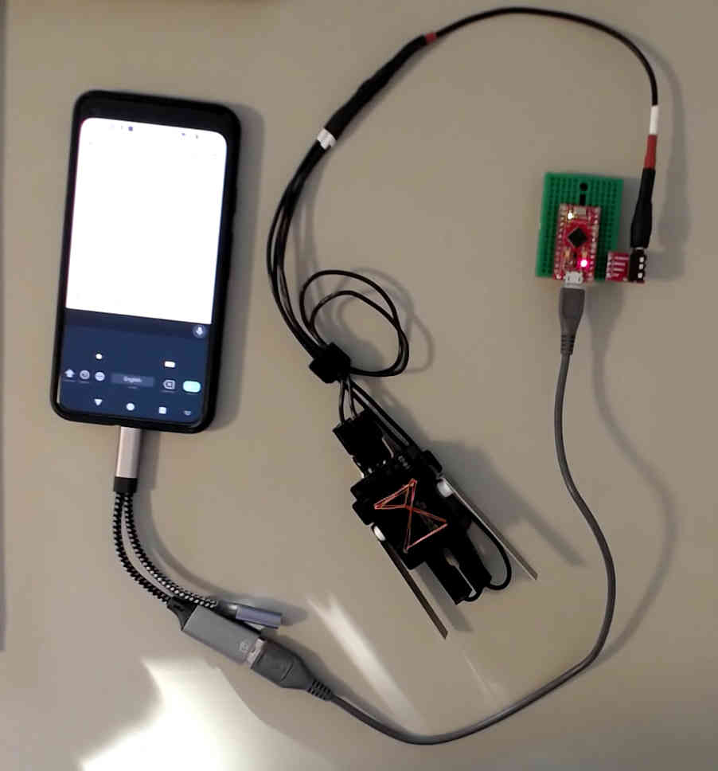

# gboard-morse-keyer
Use a standard CW iambic key with Google Gboard Morse code input method.

## background
GBoard requires the use of a keyboard (or keyboard emulator) for morse code input. They call it a "switch" but it's more than just a switch! As far as I can tell, Gboard doesn't support straight keys at all (only iambic).

In amateur radio, even the nicest iambic keys are just electrical switches. But modern android phones don't have GPIO pins exposed, so can't read a simple pair of switches. 

## what is this?
This code runs on a arduino-compatible 32u4 board, monitors one or two electrical switches, and generates the '.' and '-' keypress signals that Gboard expects. I used a Sparkfun Pro Micro, but an Arduino Nano or Leonardo should work the same - just change the LED and switch input pin numbers, or disable LED output.

I use my iambic key for actual CW, so I used a TRS jack to make the connection. The sleeve is ground, the tip is the "dit" switch, and the sleeve is the "dah".

You'll need a "USB OTG Cable" or USB Hub for your phone, as well as a USB-A/USB-microB cable to connect to the emulator. Or you can get a specialty cable that connects your phone (probably USB-C) to your microcontroller (mine's USB-microB but yours could be miniB or even USB-C). You don't need a powered hub because the board uses <10mA at all times, but you might like a cable with the charge-through feature, so you can charge your phone at the same time.

Note that key repeat speed is configured in GBoard settings. I don't think audio feedback is available in software, but it can't be added in hardware without syncing key repeat speed with the software. 
